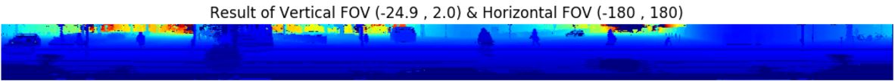
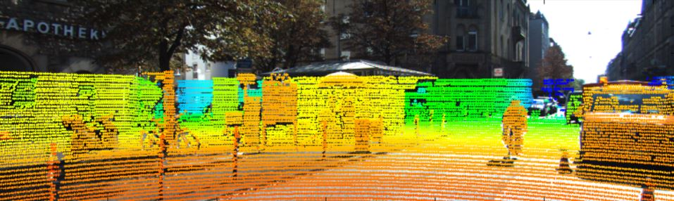
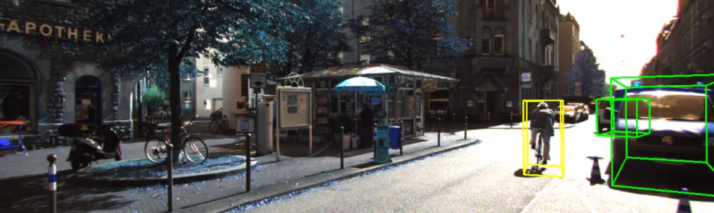

# KITTI Tutorial
  
## Introduction  
  
>This is personal result for studying Self-Driving Techs. In this tutorial, I'll upload various codes from basic methods(e.g. lidar point projection) to state-of-the-art techs(e.g. deeplearning-based vehicle detection). Mainly, 'velodyne, camera' data-based approach will be discussed but when the time allows, I'll treat stereo vision, too. Also, Kitti-dataset-related simple codes(e.g. load tracklet or velodyne points) are in [`kitti_foundation.py`](kitti_foundation.py) coded by myself.  
  
Before start,  
 
* [KITTI site](www.cvlibs.net/datasets/kitti/) 
* refer to [KITTI Dataset Paper](http://www.cvlibs.net/publications/Geiger2013IJRR.pdf) for the details of data measurement environment  
  
   
## Dataset  
 
[KITTI 2011_09_26_drive_0005 dataset](http://www.cvlibs.net/datasets/kitti/raw_data.php?type=city) 
 
## tutorials

[`Velodyne -> Panoramic Image`](Convert_Velo_2_Pano.ipynb) : Convert Velodyne data(model : HDL-64E) to panoramic image.  

     

  
  
[`Velodyne -> Top-View Image`](Convert_Velo_2_Topview.ipynb) : Convert Velodyne data(model : HDL-64E) to Top-view image.    

     

  
  
[`Velodyne to Image Projection`](velo2cam_projection.ipynb) : Project Velodyne points(model : HDL-64E) to camera Image.  

     

  
  
[`Display 3D Tracklet`](display_groundtruth.ipynb) : Display 3D Tracklet on image  

     

  
  
  
  
## Contributions / Comments  
always welcome any kind of comments and pull-requests